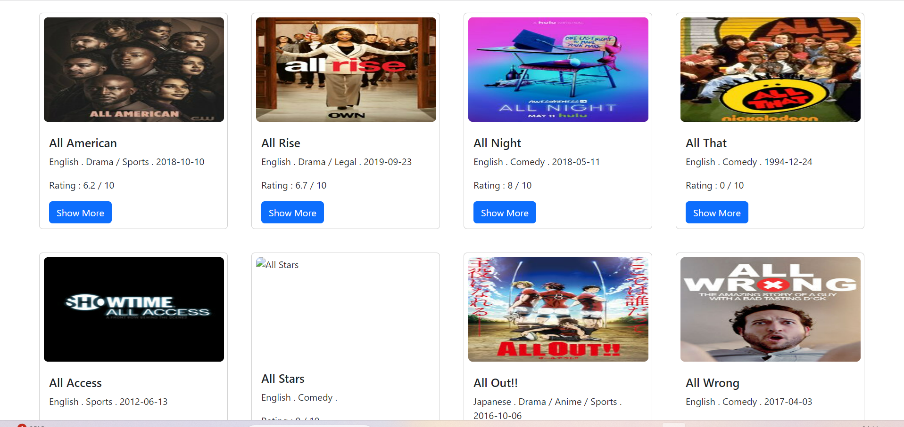
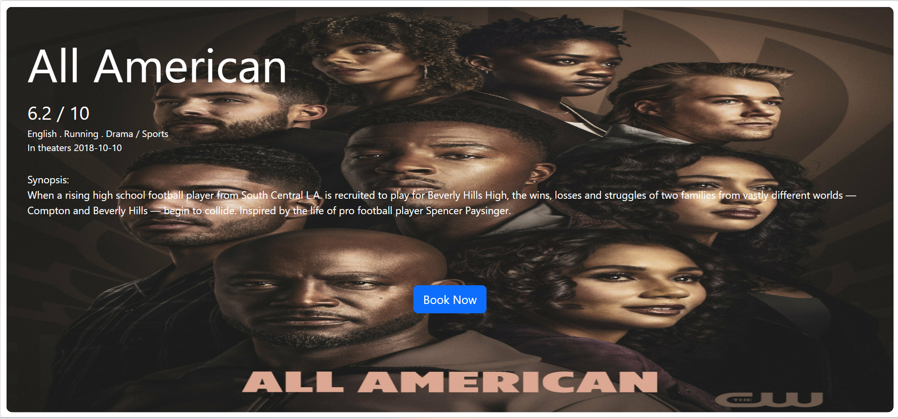
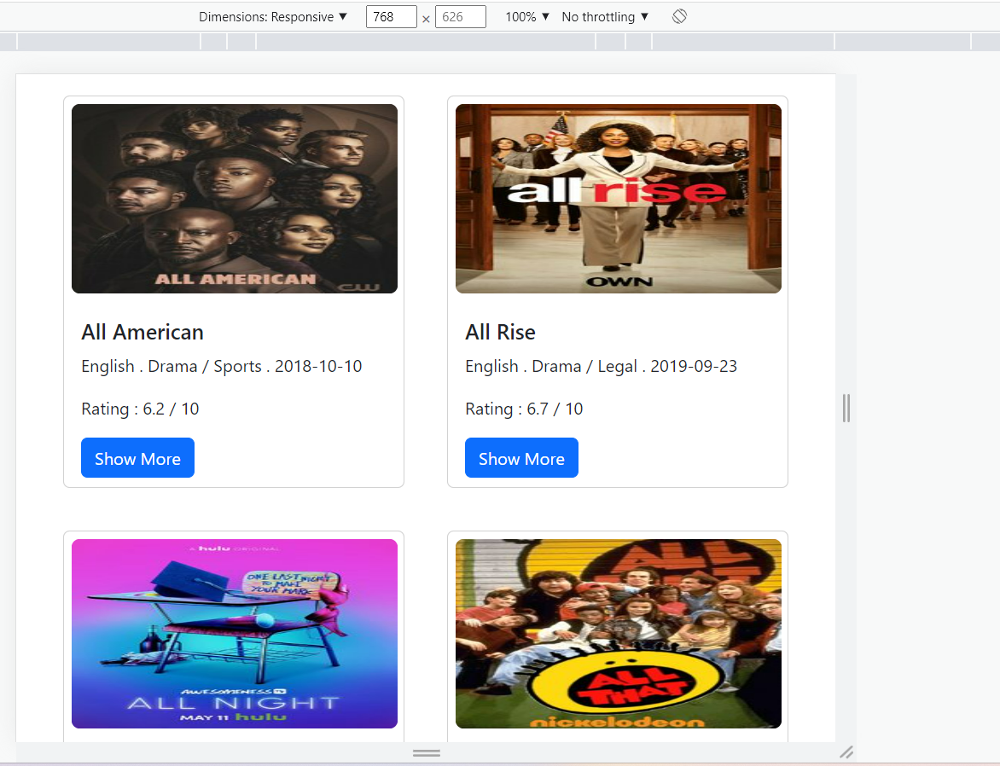
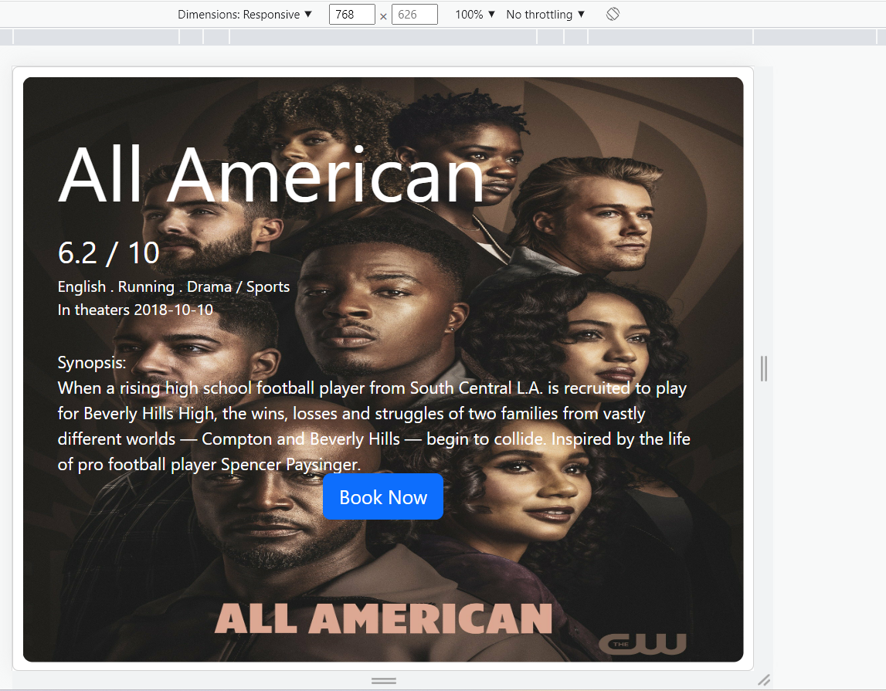
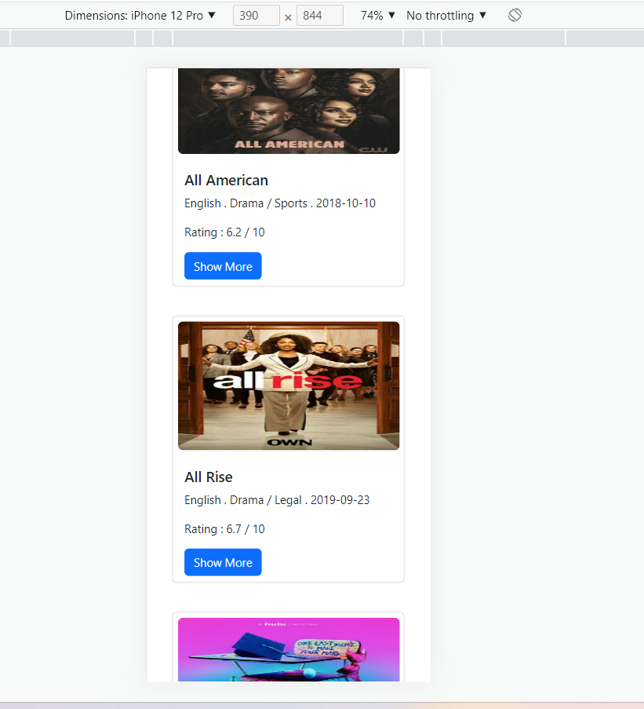
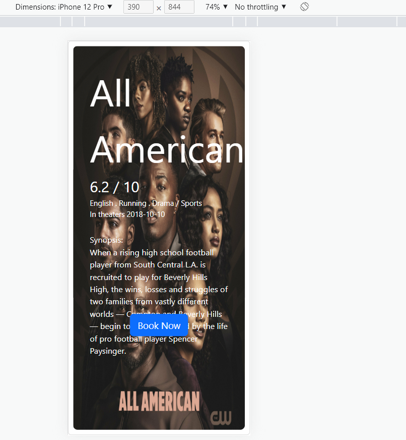
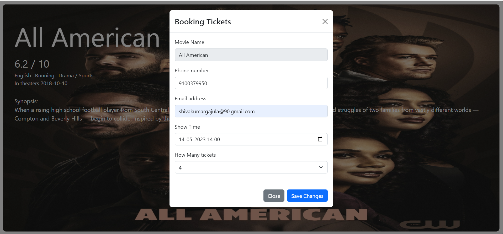
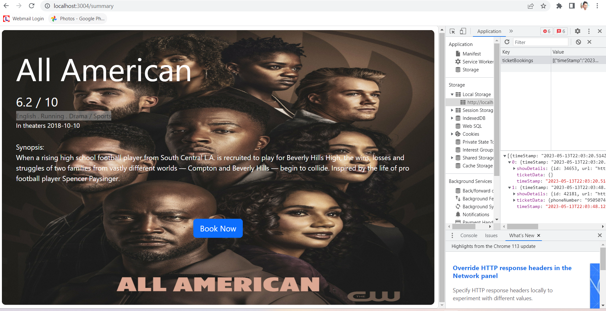
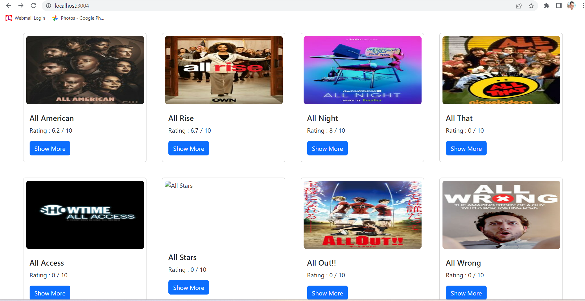

# This Repo is for Test Submission for QuadB Tech
Test submission for Intern position for QuadB Tech 
open (https://quadbtech.com/index.html) to view it in your browser.

## Available Scripts

In the project directory, you can run:

### `npm start`

Runs the app in the development mode.\
Open [http://localhost:3000](http://localhost:3000) to view it in your browser.

The page will reload when you make changes.\
You may also see any lint errors in the console.

## TASK Details
We need you to create a basic UI to display the show names and a few details about it (you can choose what you want to display along with the show name). Include a button for each of the shows to redirect the user to another screen that shows the summary of the particular show. (Refer to the api structure. You will find a summary section for each show there.). We need you to complete this assignment and upload it to a GitHub Repository marked as Public and email us back the link to the repository (check the contact section for the email address).

Please note: 
It has to be a React JS application.
It has to implement the API and not just hardcode data from the API.
It has to have 2 screens at a minimum. One to display a few data and possibly an image(UI is completely up to you) and another screen to show it’s summary.
The second screen should have a button to book a movie ticket which will open a form with the movie name already present and a few relevant details.
(Reload should not happen)
(Use local/session storage for storing user details)
A proper UI so that we know you have a good understanding of UI/UX. Doesn’t need to have mind blowing animations but just basic HTML and CSS styling that looks good (You may use bootstrap).
Please use proper Component file structure.

Respective Screenshots to

# Laptop View

# Tab View

# Mobile View

# Ticket booking form

# Working with LocalStorage

